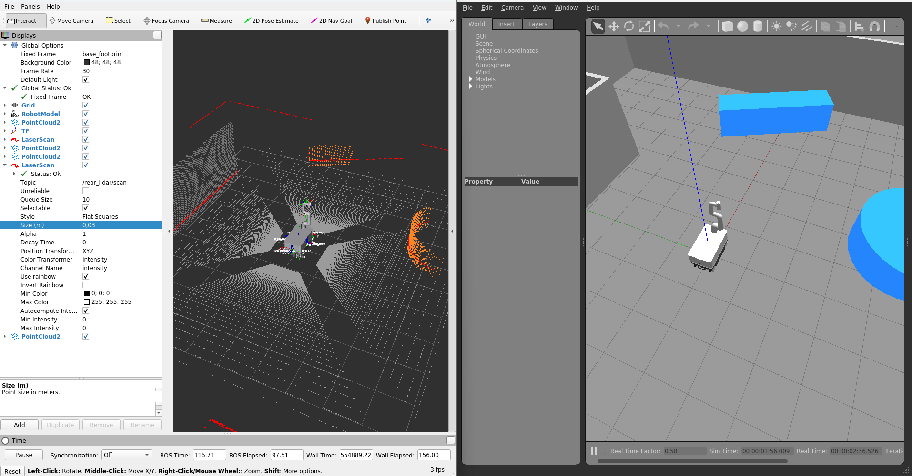
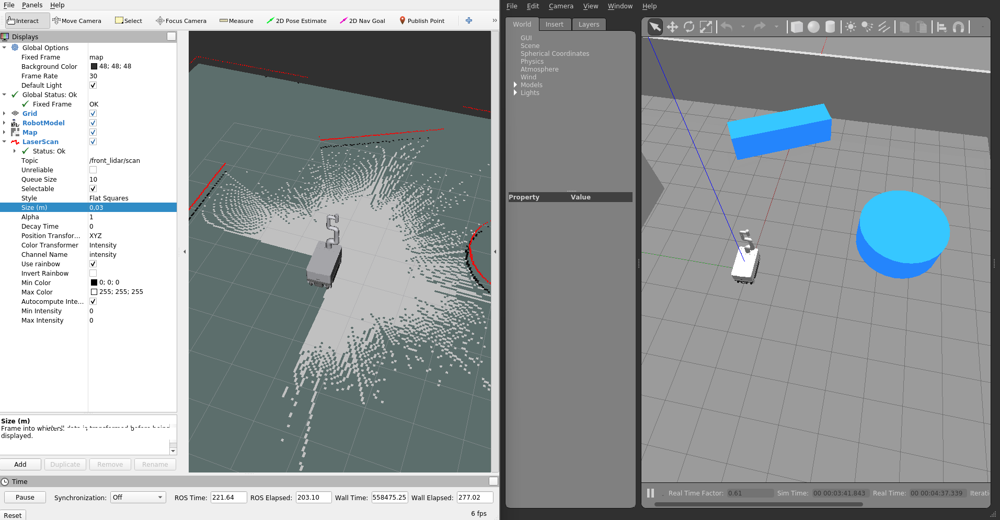
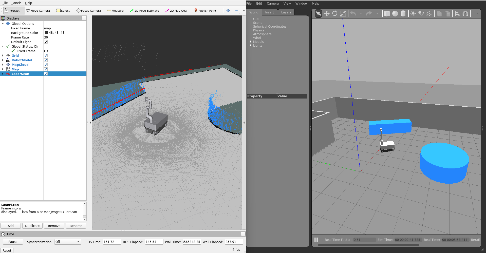
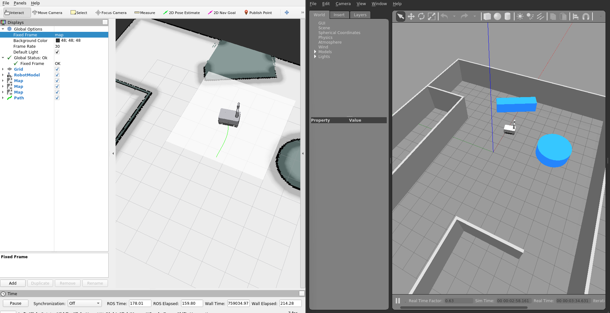

# MOBY ROS Noetic

## Installation
### Supported OS
* Ubuntu 20
* ROS Noetic
* Python 3.8

### BIOS Setting (NUC)
* Connect monitor, keyboard and mouse to NUC and reboot, press F2 to enter BIOS Setup 
* **Boot** > **Secure boot** > **Secure boot** > **Disabled**
* **Power** > **Secondary Power Settings** > **After Power Failure** > **Power On**
* **Advanced** > **Onboard Devices** > **Bluetooth** > *Uncheck*
* Press **F10** to Save and Exit

### Basic Setup
* Install basic tools (make sure sudo apt-get update finishes w/o any error)
```bash
sudo apt-get update \
&& sudo apt-get install -y git openssh-server net-tools \
&& sudo apt-get install -y python3-pip \
&& sudo pip3 install --upgrade pip \
&& sudo pip3 install setuptools \
&& sudo pip3 install rospkg \
&& pip3 install --upgrade setuptools \
&& sudo apt-get install jupyter
```

* Disable kernel update (kernel updates sometimes break some package functions)
```bash
sudo apt-mark hold linux-image-generic linux-headers-generic
```

### Install ROS noetic

The following software needs to be installed:
- [ROS1 Noetic](https://wiki.ros.org/noetic/Installation)
- indyDCP3
    ```bash
    pip3 install neuromeka
    pip3 install --upgrade neuromeka
    ```


#### Install ROS noetic dependent packages
```bash
sudo apt install  ros-noetic-ira-laser-tools \
                  ros-noetic-teb-local-planner \
                  ros-noetic-sick-scan-xd \
                  ros-noetic-slam-toolbox \
                  ros-noetic-robot-localization \
                  ros-noetic-navigation \
                  ros-noetic-joint-state-controller \
                  ros-noetic-joint-state-publisher-gui \
                  ros-noetic-teleop-twist-joy \
                  ros-noetic-teleop-twist-keyboard \
                  ros-noetic-realsense2-camera \
                  ros-noetic-librealsense2 \
                  ros-noetic-realsense2-description \
                  ros-noetic-rtabmap-ros \
                  ros-noetic-octomap-ros \
                  ros-noetic-octomap-rviz-plugins \
                  ros-noetic-gazebo-ros \ 
                  ros-noetic-gazebo-ros-pkgs \
                  ros-noetic-gazebo-ros-control
```

Install libraries:
```bash
sudo apt install v4l-utils
sudo apt install libsdl-image1.2-dev
sudo apt install libsdl-dev
sudo apt install -y libgazebo11-dev
```

#### source workspace
```bash
source /opt/ros/noetic/setup.bash
echo 'source /opt/ros/noetic/setup.bash' >> ~/.bashrc
```
 
### Build Moby Source
* Create workspace and build the source code

```bash
git clone <this repository url>
cd ~/moby-ros/
catkin_init_workspace src/
sudo chmod +x src/moby_bringup/src/*
sudo chmod +x src/moby_gazebo/src/*
catkin_make
```

* Source setup file
```bash
source devel/setup.bash
```

## Usage

### NOTE

- Moby description: define Moby model
- Moby bringup: connect to Moby GRPC server
- Moby mapping: mapping using cartographer or slam toolbox
- Moby navigation: navigation with Moby
- Moby gazebo: gazebo simulation for Moby

Use **moby_type** to choose specific robot **(moby_rp, moby_rp_v3)**.\
If not specified, the default value will be moby_rp.

### Simulation Robot

Use **world_file** to choose specific world file.\
If not specified, the default value will be example.

#### Start Simulation Robot

```bash
roslaunch moby_gazebo moby_gazebo.launch moby_type:=moby_rp rviz:=true 
```




#### To Start Mapping

* Slam toolbox
```bash
roslaunch moby_mapping slam_toolbox.launch use_sim_time:=true
```




* Rtabmap
```bash
roslaunch moby_mapping moby_rtabmap.launch use_sim_time:=true
```




#### To Start Navigation

```bash
roslaunch moby_navigation navigation.launch use_sim_time:=true
```



### Real Robot

#### Moby Setting
- Change the Moby config in ```moby-ros2/moby_bringup/param/moby_config.yaml```
* Moby Type
  - Robot type [moby_rp, moby_agri]
* Step IP
  - Ip address of STEP PC
* Sick IP
  - Connect Windows Computer (with Sopas ET installed) to the router.
  - Open Sopas ET and scan devices
  - Change IP address of the TIM lidars
    - front: 192.168.214.10
    - rear: 192.168.214.11
* Realsense
  - Open ```realsense-viewer``` from NUC
  - Check serial numbers for each camera
  - Change serial numbers in config file

#### To Start Control Moby
```bash
roslaunch moby_bringup moby_bringup.launch
```

#### To Start Mapping

- Connect to the controller
  - Press **X + Home** button to connect controller to Moby (red led ON)
  - When the controller connected
    - To move: Press **L2 + Left joystick** for moving (non-holonomic)
    - To move: Press **L2 + Right joystick** for moving (holonomic)
    - To change speed: Press **R, R2** to change speed. Maximum 0.8 m/s (linear), 0.8 rad/s (angular)

- Using Slam Toolbox
```bash
roslaunch moby_bringup moby_bringup.launch
roslaunch moby_mapping slam_toolbox.launch
```

- To see the Map
  - On Rviz press Add (Near bottom left) => Choose Map
- To save the Map
```bash
rosrun map_server map_saver -f ~/<map_name>
```

#### To Start Navigation

- Change the map before navigation
  - Copy map file to **moby_navigation/map** (2 files .pgm and .yaml)
  - Modify yaml file: Change the path link to pgm file to: **image: <map_name.pgm>**
  - In folder **moby_navigation/launch** modify **navigation.launch.py** change map file in **map_dir** variable (line 30).

```bash
roslaunch moby_bringup moby_bringup.launch
roslaunch moby_navigation navigation.launch
```
- Can tuning navigation parameter in **moby_navigation/param** folder.


#### Pairing PG-9023S with External Bluetooth Dongle
* [Prerequisite] Disable onboard bluetooth as described in BIOS Setting section
* After boot, Login and Open Bluetooth setting
* Push and hold **HOME + X** on *PG-9023S* until SEARCH LED blinks rapidly
* Find *PG-9023S* on the bluetooth device list and connect.
